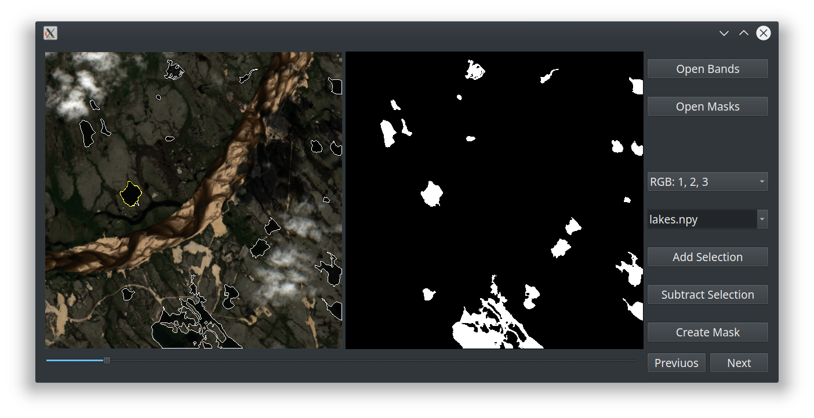

# Satellite imagery labeller

This is a tool for object labelling, that takes  special features of satellite images into account. It allows tile-by-tile image browsing, different band combinations veiwing and 'magic-wand'-like object selection.

## Getting started

* Clone repository
* Set sat-img-lab as a current directory
* Create virtual environment
* Source virtual environment
* Install requirements 
* Run script

```sh
$ git clone https://github.com/WGussev/sat-img-lab.git
$ cd sat-img-lab
$ python3 -m pyenv envname
$ source envname/bin/activate
$ pip install -r < requirements.txt
$ python3 labeller.py
```

## Example

1. Open a folder containing band images (developed with Sentinel-2 spectral channels in mind).
1. Open a folder with mask (.npy) files.
1. Choose or create a mask to work with.
(you should have a separate mask for every object type) 
1. Browse images with previous/next buttons.
1. Choose different image band combinations with the combobox.
1. Choose objects and add them to the mask.



## Notes

The tool is under developement. Feedback appreciated.